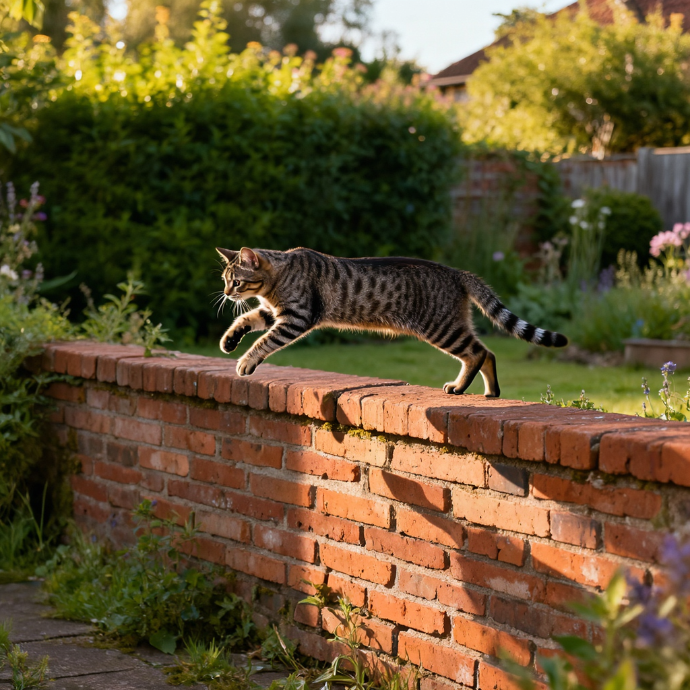

<h1 align="center" style="line-height: 50px;">
Forge-and-Quench: Enhancing Image Generation for Higher Fidelity in Unified Multimodal Models
</h1>

<p align="center">
<a href="https://arxiv.org/abs/2601.04706"></a>
<a href="https://huggingface.co/zengyb6666/Forge-and-Quench"></a>

</p>

## Introduction
We propose Forge-and-Quench, a new unified framework that puts this principle into practice. In the generation process of our framework, an MLLM first reasons over the entire conversational context, including text instructions, to produce an enhanced text instruction. This refined instruction is then mapped to a virtual visual representation, termed the Bridge Feature, via a novel Bridge Adapter. This feature acts as a crucial link, forging insights from the understanding model to quench and refine the generation process. It is subsequently injected into the T2I backbone as a visual guidance signal, alongside the enhanced text instruction that replaces the original input. To validate this paradigm, we conduct comprehensive studies on the design of the Bridge Feature and Bridge Adapter. Our framework demonstrates exceptional extensibility and flexibility, enabling efficient migration across different MLLM and T2I models with significant savings in training overhead, all without compromising the MLLM's inherent multimodal understanding capabilities. Experiments show that Forge-and-Quench significantly improves image fidelity and detail across multiple models, while also maintaining instruction-following accuracy and enhancing world knowledge application.


## How to Use

### Environment
```bash
git clone git@github.com:YanbingZeng/Forge-and-Quench.git
cd Forge-and-Quench
conda create -n faq python=3.10
conda activate faq
pip install -r requirements.txt
pip install git+https://github.com/huggingface/diffusers
pip install sentencepiece --prefer-binary -i https://pypi.org/simple
```

### Inference
FaQ inference with FLUX.1-dev model
```bash
python3 infer.py --qwen25_vl_path /path/to/Qwen2.5-VL-7B-Instruct --forge_and_quench_model_path /path/to/Forge-and-Quench --t2i_model flux1-dev --t2i_model_path /path/to/FLUX.1-dev
```
FaQ inference with LongCat-Image model
```bash
python3 infer.py --qwen25_vl_path /path/to/Qwen2.5-VL-7B-Instruct --forge_and_quench_model_path /path/to/Forge-and-Quench --t2i_model longcat-image --t2i_model_path /path/to/LongCat-Image
```
Inference Results
```python
Prompt="A photograph capturing a cat gracefully jumping down from a wall, its fur sleek and shimmering in the soft afternoon light. The wall is made of rustic brick, adding texture and contrast to the scene. The background is a serene garden with lush greenery, providing a natural and tranquil setting. The composition uses a mid-air shot to freeze the cat's motion, highlighting its agility and elegance. The lighting is warm and natural, casting gentle shadows that enhance the depth and detail of the cat's form. The overall atmosphere is one of dynamic movement and serene beauty, emphasizing the cat's playful and adventurous spirit."
```
| FLUX.1-dev-T2I | FLUX.1-dev-FaQ |
| :---: | :---: |
|  |  |

| LongCat-Image-T2I (w/o cfg renorm) | LongCat-Image-FaQ (w/o cfg renorm)|
| :---: | :---: |
|  |  |

| LongCat-Image-T2I (with cfg renorm) | LongCat-Image-FaQ (with cfg renorm)|
| :---: | :---: |
|  |  |


## Citation
```bibtex
@article{zeng2026forgeandquench,
      title={Forge-and-Quench: Enhancing Image Generation for Higher Fidelity in Unified Multimodal Models}, 
      author={Yanbing Zeng and Jia Wang and Hanghang Ma and Junqiang Wu and Jie Zhu and Xiaoming Wei and Jie Hu},
      journal = {arXiv preprint arXiv:2601.04706},
      year={2026},
      url={https://arxiv.org/abs/2601.04706}, 
}
```